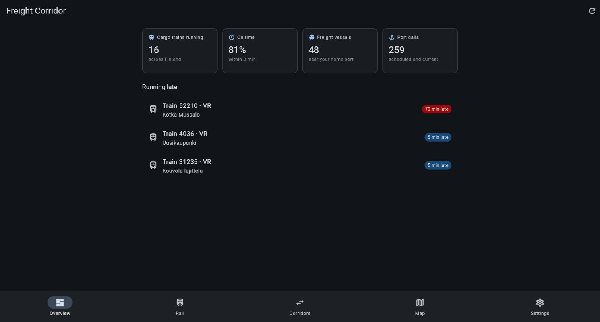
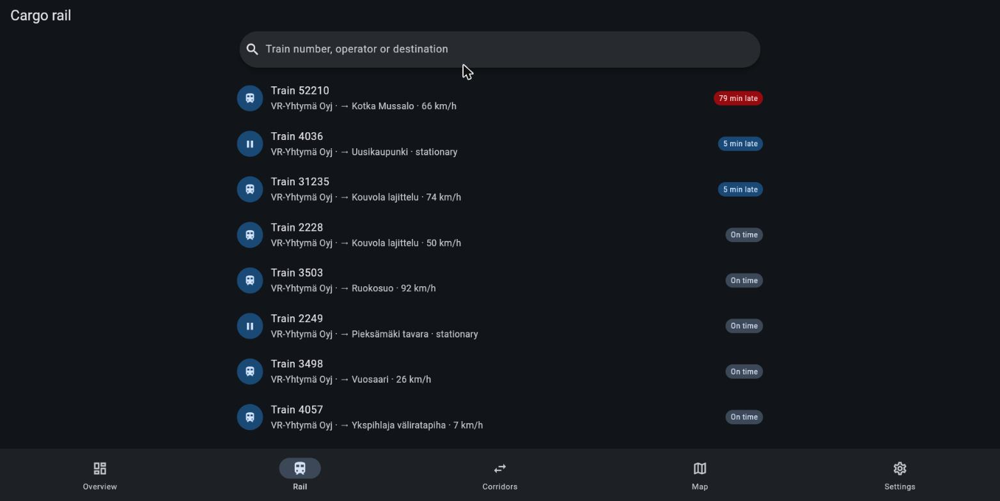
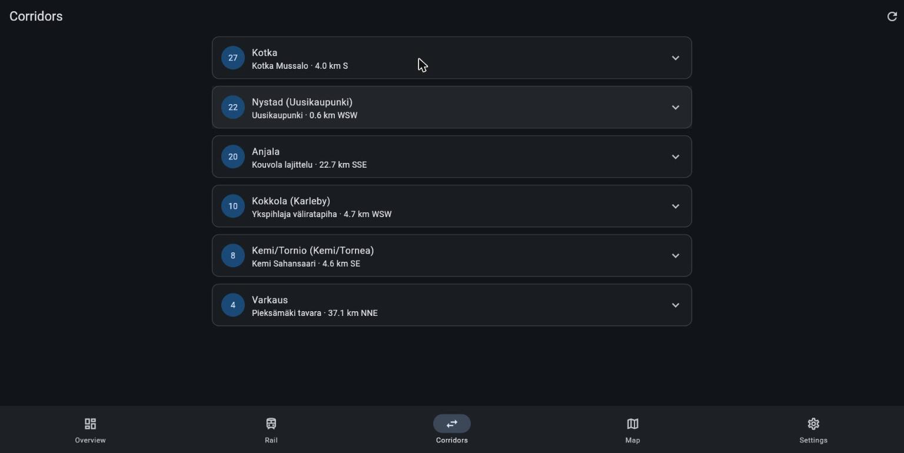
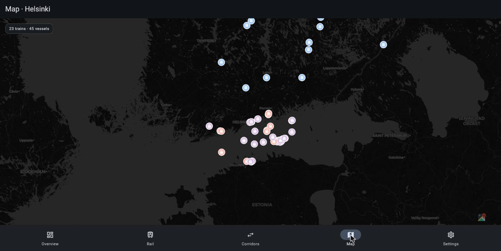
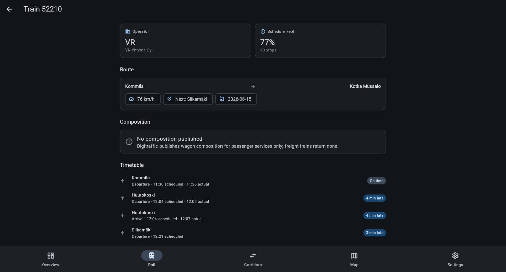
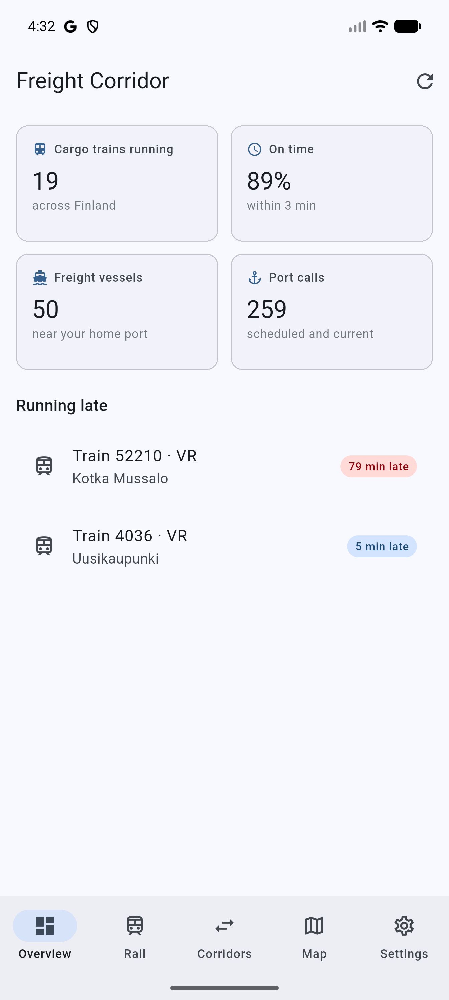
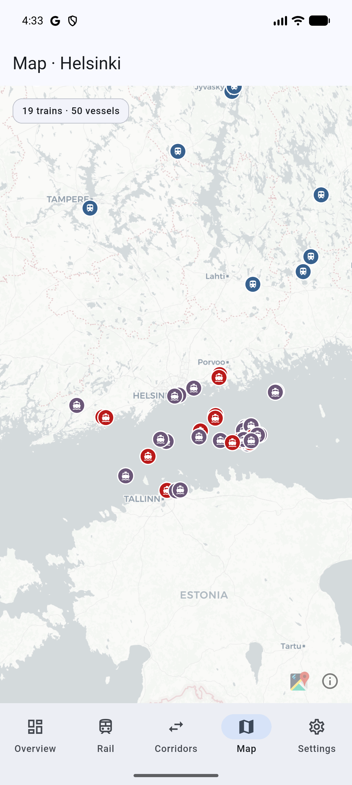
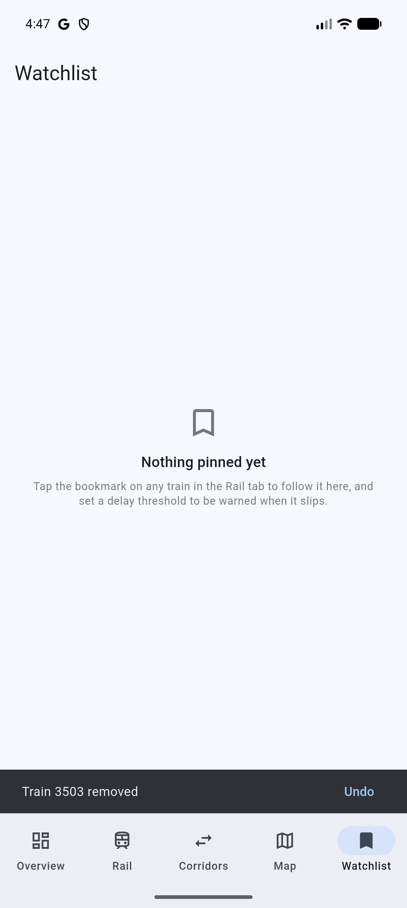

# 🚂 Flutter Freight Corridor

> Live Finnish freight logistics on **Flutter** and **Dart** — cargo trains over a real
> **GraphQL** API, vessels and port calls over **REST**, joined into multimodal corridors by a
> pure-Dart core package.

Data flows: `Digitraffic rail GraphQL ─┐` `Digitraffic marine REST ─┴→ FreightRepository → Riverpod → Android + Web`

📖 **[Live demo](https://calemccammon.github.io/flutter-freight-corridor/)** — real data, no API key, no sign-up.

---

## What This Project Demonstrates

| Concept | How it's shown |
|---|---|
| **Dart as a language, not just Flutter glue** | `packages/freight_core` has zero Flutter imports and 49 tests that run in under a second |
| **GraphQL against a real endpoint** | Digitraffic's railway API genuinely speaks GraphQL; `ferry` generates type-safe Dart from the committed schema |
| **Two transports, one abstraction** | GraphQL and REST both disappear behind `FreightRepository`; the UI cannot tell which screen is which |
| **Async UI states done once** | `AsyncValue` drives loading / error / empty / data through a single `AsyncValueView` |
| **Platform differences handled honestly** | A conditional import sets `Accept-Encoding` on the VM and deliberately omits it in the browser |
| **A domain worth modelling** | AIS bit-packed ETAs, ITU ship-type bands, schedule adherence and rail-to-seaport pairing are all real rules with real edge cases |
| **Widget-level fundamentals** | The watchlist carries `StatefulWidget` lifecycle, a validated `Form`, `Dismissible` swipe-with-undo, `Hero` and `AnimatedSwitcher` — see below |

---

## Why Finland

Fintraffic's **Digitraffic** platform is one of the few genuinely open freight datasets in the
world: live cargo trains, live AIS vessel positions and official port calls, all free, all
without an API key, and — unusually — with a **public GraphQL endpoint** for the railway side.
That last detail is why this project uses GraphQL at all: because the upstream actually speaks
it, not because it was bolted on for show.

---

## Architecture

```
   rata.digitraffic.fi/api/v2/graphql        meri.digitraffic.fi/api/...
              (GraphQL)                               (REST)
                  │                                     │
          RailDataSource                        MarineDataSource
       ferry + generated types              package:http + SnapshotStore
                  │                                     │
                  └──────────────┬──────────────────────┘
                                 │
                       FreightRepository
            one façade · returns only freight_core models
                       · one exception type
                                 │
                  ┌──────────────┴──────────────┐
                  │                             │
        Riverpod providers            packages/freight_core
     Future / Stream / Notifier      PURE DART — no Flutter
                  │                  models · geo · AIS codes
                  │                  schedule · corridor_linker
             AsyncValue<T>                       ▲
                  │                              │
            AsyncValueView ───── widgets ────────┘
                  │
        go_router shell · 5 tabs · Android + Web
```

The load-bearing idea is that **nothing GraphQL-shaped and nothing HTTP-shaped escapes the data
layer.** `FreightRepository` returns only `freight_core` types, so swapping either transport
would touch exactly one file — and the business rules can be tested without a widget tree, a
device, or a network.

---

## Tech Stack

| Layer | Tool |
|---|---|
| Framework | Flutter 3.47 / Dart 3.13 |
| State | Riverpod 3.4 (`FutureProvider`, `StreamProvider`, `Notifier`) |
| Routing | go_router 17 — `StatefulShellRoute` with deep-linkable URLs |
| GraphQL | ferry 0.16 + `ferry_generator`, schema committed |
| REST | `package:http` |
| Maps | flutter_map 8 with CARTO basemaps (keyless, CORS-enabled) |
| Persistence | `shared_preferences` behind a `SnapshotStore` interface |
| Domain | `packages/freight_core` — pure Dart, `meta` + `collection` only |
| Tests | `dart test`, `flutter_test`, `mocktail`, `MockClient`, a fake ferry `Link` |
| CI | GitHub Actions → format, codegen, analyze, test, build, deploy to Pages |

---

## Getting Started

```bash
# 1. Install Flutter 3.47 (https://docs.flutter.dev/get-started/install)
flutter --version          # expect Flutter 3.47.x / Dart 3.13.x

# 2. One pub get bootstraps both workspace members
flutter pub get

# 3. Generate the GraphQL types (not committed — see Project Structure)
cd app && dart run build_runner build

# 4. Run it. No API key, no .env, no account.
flutter run -d chrome      # or: flutter run -d <android-device>
```

> **If the Android build fails** with `Unresolved reference 'plugins'` in `settings.gradle.kts`:
> that is Gradle's Kotlin DSL failing to build its own classpath, not a problem with this project.
> It happens when `GRADLE_USER_HOME` sits behind a symlink or junction — a Scoop-installed Gradle
> puts it under `scoop\apps\gradle\current\.gradle`, and `current` is a junction. Point it at a
> real directory (`GRADLE_USER_HOME=%USERPROFILE%\.gradle`) and it builds. Web and tests are
> unaffected either way.

```bash
# Domain logic only — no Flutter, no network, ~1 second
cd packages/freight_core && dart test

# Everything. All external calls are mocked; CI needs no secrets.
cd app && flutter test

# Optional: hit the real APIs and print what came back
cd app && dart run tool/smoke.dart
```

---

## Screenshots

| Overview | Cargo rail |
|---|---|
|  |  |

| Corridors | Map |
|---|---|
|  |  |

| Train detail |
|---|
|  |

The same source on Android (Pixel 9 Pro XL emulator, light theme — the web shots above are dark,
and both palettes come from one `ColorScheme.fromSeed`):

<p align="center">
  
  
  
</p>

---

## Tests

91 tests. Every external call is mocked, so CI needs no network and no secrets.

| Test | What it verifies |
|---|---|
| `geo_test` | Haversine against the real Helsinki–Tampere distance; bearing and 16-point compass; `[lon, lat]` ordering |
| `ais_codes_test` | ITU ship-type bands (70–79 cargo, 80–89 tanker); AIS bit-packed ETA decoding, sentinels and year rollover; length/beam from reference points |
| `schedule_test` | Delay buckets at their boundaries; worst delay ignores early running; adherence returns null (not zero) for an empty sample; no ETA for a stationary train |
| `geojson_test` | `timestampExternal` is used, not the AIS second-of-minute field; malformed features are skipped, not thrown on |
| `corridor_linker_test` | A terminus pairs with the nearest seaport in radius; foreign ports and out-of-range termini are excluded; corridors ordered by traffic |
| `rail_data_source_test` | A real ferry client over a fake `Link` maps GraphQL onto models — so schema, query and mapping cannot silently drift apart |
| `marine_data_source_test` | Headers and query params; UTF-8 decoding of Finnish names; cache fallback when the network drops; the port directory is trimmed before caching and reused on the next load; non-200 handling |
| `freight_repository_test` | Both transports collapse into one `FreightException`; non-freight vessels dropped; LOCODEs no ship visits excluded |
| `widgets_test` | `AsyncValueView` renders all four states; delay chips label each bucket; rail list sorts and filters; failures offer a retry |
| `watchlist_test` | Threshold validation and clamping; pins persist and rehydrate, dropping malformed stored entries; pins resolve against the live feed so a finished run disappears; alerts fire only above the threshold; swipe removes a row and offers undo; an invalid threshold is rejected without overwriting the stored value |

---

## Project Structure

```
flutter-freight-corridor/
├── pubspec.yaml                     # pub workspace root — one lockfile for both packages
├── analysis_options.yaml            # shared lints, strict-casts, strict-raw-types
│
├── packages/freight_core/           # PURE DART — no Flutter import anywhere
│   ├── lib/src/models/              # geo_point, freight_train, vessel, port, port_call, corridor
│   └── lib/src/logic/
│       ├── geo.dart                 # haversine, bearing, compass, knots↔km/h
│       ├── ais_codes.dart           # ITU ship types, nav status, bit-packed ETA
│       ├── schedule.dart            # delay buckets, adherence, ETA estimation
│       ├── geojson.dart             # AIS + port directory parsing, [lon,lat] handling
│       └── corridor_linker.dart     # ← the rail↔sea join. Plain functions over plain data
│
└── app/
    ├── build.yaml                   # ferry codegen config; Date/DateTime → String
    ├── lib/data/
    │   ├── graphql/schema.graphql   # committed, so CI never needs the live endpoint
    │   ├── graphql/cargo_trains.graphql
    │   ├── rail_data_source.dart    # ferry → freight_core
    │   ├── marine_data_source.dart  # http → freight_core, with cache fallback
    │   ├── digitraffic_headers*.dart# conditional import: VM vs browser
    │   ├── snapshot_store.dart      # interface, so the data layer stays Flutter-free
    │   └── freight_repository.dart  # the one seam between app and outside world
    ├── lib/providers/               # Riverpod providers, written by hand (see below)
    │   └── watchlist.dart           # pins + delay threshold, persisted and validated
    ├── lib/screens/                 # overview, rail, train detail, corridors, map,
    │   │                            #   watchlist, settings
    │   └── watchlist_screen.dart    # ← StatefulWidget, Form, Dismissible, animations
    ├── lib/widgets/                 # async_value_view, page_body, delay chip, stat card,
    │                                #   composition bar, bookmark button
    └── tool/smoke.dart              # hits the real APIs and prints results
```

---

## Data Sources

All open data from **[Fintraffic Digitraffic](https://www.digitraffic.fi/en/)**. No API key.

Licensed under **[CC BY 4.0](https://creativecommons.org/licenses/by/4.0/)**, which permits
this use and requires attribution in return: credit to Fintraffic, a link to the source, an
indication of the licence, and a note where the data has been modified. This app **modifies**
it — delays are classified into bands, and corridors are derived by linking a train's terminus
to the nearest port with a cargo call in-window — so what it displays is a derived work rather
than raw Digitraffic output.

| Feed | Endpoint |
|---|---|
| Cargo trains (GraphQL) | `rata.digitraffic.fi/api/v2/graphql/graphql` — `currentlyRunningTrains`, filtered to `trainCategory: "Cargo"` |
| Wagon compositions | same endpoint — `compositions { journeySections { wagons locomotives } }` (see caveat below) |
| Vessel positions (AIS) | `meri.digitraffic.fi/api/ais/v1/locations` |
| Vessel details | `meri.digitraffic.fi/api/ais/v1/vessels` |
| Port calls | `meri.digitraffic.fi/api/port-call/v1/port-calls` |
| Port directory | `meri.digitraffic.fi/api/port-call/v1/ports` |

Two things every client must get right, both handled in one place here:

- **`Accept-Encoding: gzip` is mandatory.** Digitraffic answers `406 Not Acceptable` without it.
- **`Digitraffic-User`** identifies the client and raises the rate limit above anonymous.

---

## Key Concepts Explained

### Generated code is not committed

`ferry_generator` emits built_value types and serializers for the *entire* Digitraffic schema —
129 types — regardless of what you actually query. Measured here: **49,155 lines across 12 files
(1.4 MB)** from two queries. Committing that would outweigh the hand-written source roughly 25 to
1 and completely misrepresent the size of the project, so it is gitignored and regenerated in CI
from the committed `schema.graphql`. Builds stay reproducible without the noise.

This also dictates the CI step order: **format runs before codegen** (while only hand-written
files exist) and **analyze runs after** (it cannot resolve without the generated types).

### Riverpod providers are written by hand

Not an oversight. `riverpod_generator ≥4.0.6` requires `analyzer ^13.0.0`; every published
`ferry_generator` caps `analyzer <13.0.0`. The two cannot co-resolve, and GraphQL type-safety was
the point — so ferry keeps its generator and providers are declared explicitly. Each one costs a
few lines and makes the actual provider types visible in the source, which suits a project meant
to be read.

### `[lon, lat]`, and a timestamp that isn't one

Both APIs report coordinates as `[longitude, latitude]` — the reverse of how they're spoken.
Worse, the AIS payload has a `properties.timestamp` field that is **not a timestamp**: it's the
AIS second-of-minute (0–59). Reading it as one puts every vessel in January 1970. The real
instant is `timestampExternal`. Both traps are encoded once in `geojson.dart` and covered by
tests, rather than lurking at each call site.

### Deriving meaning from three booleans

The port-call feed exposes `arrivalWithCargo`, `notLoading` and `discharge` and leaves the
interpretation to you. `CargoIntent.from(...)` turns them into one value the UI can display —
loading, discharging, both, or in ballast — in a pure function with its own tests. That is the
difference between a screen that shows `notLoading: false` and one that says "Loading".

### Joining two APIs that share no identifier

The rail API knows nothing about ships; the marine API knows nothing about trains. `linkCorridors`
joins them **geographically**: take each cargo train's final station, find the nearest seaport
within a radius, and attach the vessels and port calls there. One refinement makes the results
real — the LOCODE directory lists ~18,600 places worldwide including inland towns no ship ever
visits, so the port set is narrowed to codes that actually appear in the port-call feed. Without
it, a terminus gets paired with a lakeside village; with it, you get **Kotka ← Kotka Mussalo**
and **Kokkola ← Ykspihlaja väliratapiha**, which are real freight connections.

### Wagon composition is a passenger-only feed

The schema exposes `compositions { journeySections { wagons locomotives } }` on every `Train`,
which reads like a gift for a freight app — wagon counts, train length, haulage type. It is not.
Checked against every cargo train running at the time of writing: **0 of 18 returned any
composition**, while a sample of passenger services returned 5–12 wagons each. Digitraffic
publishes composition for services where carriage detail matters to a traveller, and freight
simply isn't one.

The mapping code and its tests are kept, because the field is real and populated for other train
categories — but the train detail screen says so in as many words instead of rendering an empty
space, and this README does not claim a feature the data cannot support. Finding this needed
querying the API rather than reading the schema, which is the general lesson: a field existing in
a GraphQL schema is not a promise that it is ever non-empty for your slice of the data.

### Where the widget fundamentals live

Most of this app is `ConsumerWidget`s over Riverpod, which is the right default — but it means
whole categories of Flutter never appear. The watchlist is where they do, deliberately gathered
into one feature rather than scattered as demos:

| Fundamental | Where |
|---|---|
| `StatefulWidget` + `initState`/`dispose` | `AlertThresholdForm` owns a `TextEditingController` and `FocusNode` — lifetime-bound resources that Riverpod should *not* hold |
| `Form` + `TextFormField` + validator | The delay threshold; the rule itself is `Watchlist.validateAlertMinutes`, unit-tested away from the widget |
| `Dismissible` + undo | Swipe a pin away, with a snackbar that puts it back — destructive gestures need an exit |
| `Hero` | The train avatar animates from the Rail row into the detail screen |
| `AnimatedSwitcher` / `SizeTransition` | The alert banner grows in, the bookmark scales on toggle, Save becomes a tick |
| `Semantics` | Bookmark icons announce their state rather than reading as an unlabelled button |

The split is the point: **Riverpod owns application state, `State` owns widget-lifetime
resources.** A `TextEditingController` in a provider would outlive the field it belongs to.

### Polling, not MQTT

Digitraffic offers MQTT over WebSocket. This app polls instead. A reconnect/backoff lifecycle
plus separate server and browser client branches is a lot of surface area for something a 20-
second poll delivers — and at 20 seconds this uses 3 of the 60 requests a minute allowed. A
failed poll retries; a dropped websocket on a stranger's laptop is a broken demo.

---

## Project Comparison

| | `flutter-freight-corridor` | [`react-native-energy-insights`](https://github.com/calemccammon/react-native-energy-insights) |
|---|---|---|
| Framework | Flutter 3.47 / Dart | React Native + Expo / TypeScript |
| UI model | Widgets, composed and immutable | Components + JSX |
| State | Riverpod 3 (`AsyncValue`) | Zustand + TanStack Query |
| Data | GraphQL **and** REST behind one repository | REST via Axios |
| Domain logic | Separate pure-Dart package, 49 tests | Inline in hooks and screens |
| Targets | One codebase → Android **and** web, deep-linkable | Expo Go / simulator |

Same developer, same shape of problem — a public data API, a typed client, cached state, a tabbed
mobile UI — deliberately built twice in two ecosystems. The sharpest contrast is the last row:
Flutter compiles the same source to a native Android app *and* a URL you can share, which is why
this repo has a live demo and that one does not.

---

## License

MIT
